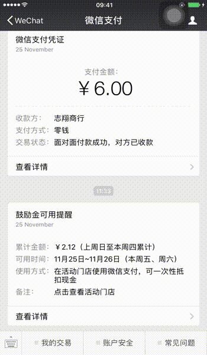
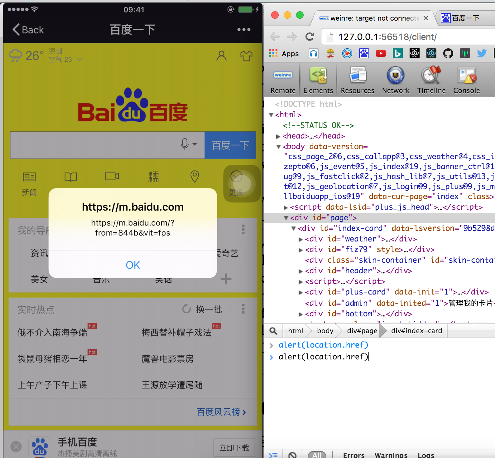
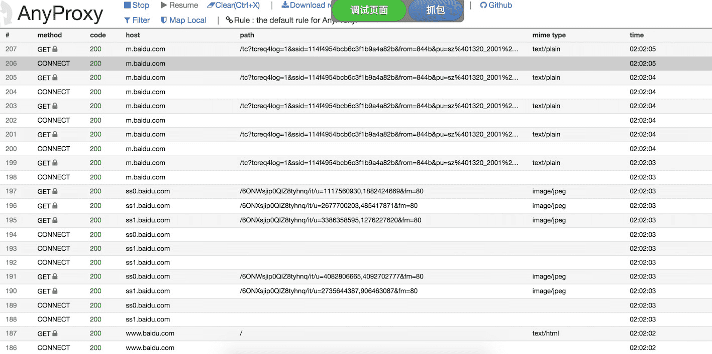

关于spy-debugger
==========
一站式页面调试、抓包工具。远程调试任何手机浏览器页面，任何手机移动端webview（如：微信，HybridApp等）。支持HTTP/HTTPS，无需USB连接设备。  

[](https://opencollective.com/spy-debugger) [](https://www.npmjs.com/package/spy-debugger)
[](https://www.npmjs.com/package/spy-debugger)
[](https://travis-ci.org/wuchangming/spy-debugger)  

Language: [English](README_EN.md)

特性
------------
>  
1、页面调试＋抓包  
2、[操作简单](#三分钟上手)，无需USB连接设备   
3、**支持HTTPS**。  
4、`spy-debugger`内部集成了[`weinre`](http://people.apache.org/~pmuellr/weinre/docs/latest/)、[`node-mitmproxy`](https://github.com/wuchangming/node-mitmproxy)、[`AnyProxy`](https://github.com/alibaba/anyproxy)。  
5、自动忽略原生App发起的https请求，只拦截webview发起的https请求。对使用了SSL pinning技术的原生App不造成任何影响。  
6、可以配合其它代理工具一起使用(默认使用AnyProxy) [(设置外部代理)](#设置外部代理默认使用anyproxy)  


使用案例
------------
#### 页面编辑模式
>  
启动命令：`spy-debugger -w true`  


#### weiner页面调试界面
>  


#### anyproxy抓包界面
>  



安装
------------
Windows 下
```
    npm install spy-debugger -g
```

Mac 下
```
    sudo npm install spy-debugger -g
```

## 三分钟上手
>  
第一步：手机和PC保持在同一网络下（比如同时连到一个Wi-Fi下）
>  
第二步：命令行输入`spy-debugger`，按命令行提示用浏览器打开相应地址。
>  
第三步：设置手机的HTTP代理，代理IP地址设置为PC的IP地址，端口为`spy-debugger`的启动端口(默认端口：9888)。
- Android设置代理步骤：`设置 - WLAN - 长按选中网络 - 修改网络 - 高级 - 代理设置 - 手动`  
- iOS设置代理步骤：`设置 - 无线局域网 - 选中网络 - HTTP代理手动`  
>  
第四步：手机安装证书。**注：手机必须先设置完代理后再通过(非微信)手机浏览器访问`http://s.xxx`[`(地址二维码)`](demo/img/QRCodeForCert.png)安装证书**（手机首次调试需要安装证书，已安装了证书的手机无需重复安装)。[iOS新安装的证书需要手动打开证书信任](https://github.com/wuchangming/spy-debugger/issues/42)
>  
第五步：用手机浏览器访问你要调试的页面即可。

自定义选项
------------
#### 端口
>  
(默认端口：9888)
```
spy-debugger -p 8888
```

#### 设置外部代理（默认使用AnyProxy）
>  
```
spy-debugger -e http://127.0.0.1:8888
```
spy-debugger内置AnyProxy提供抓包功能，但是也可通过设置外部代理和其它抓包代理工具一起使用，如：Charles、Fiddler。

#### 设置页面内容为可编辑模式
>  
该功能使页面内容修改更加直观方便。
(默认： false)
```
spy-debugger -w true
```
内部实现原理：在需要调试的页面内注入代码：`document.body.contentEditable=true`。暂不支持使用了iscroll框架的页面。

#### 是否允许weinre监控iframe加载的页面
>  
(默认： false)
```
spy-debugger -i true
```

#### 是否只拦截浏览器发起的https请求
>  
(默认： true)
```
spy-debugger -b false
```
有些浏览器发出的connect请求没有正确的携带userAgent，这个判断有时候会出错，如**UC浏览器**。这个时候需要设置为false。大多数情况建议启用默认配置：true，由于目前大量App应用自身（非WebView）发出的请求会使用到SSL pinning技术，自定义的证书将不能通过app的证书校验。

#### 是否允许HTTP缓存
>  
(默认： false)
```
spy-debugger -c true
```

更多
------------
- 修复`weinre`在`node.js` V7版本会崩溃的bug

- 对`weinre`在页面`document ready`事件前，无法打印console.log日志进行了增强修复。

- 增强`weinre`打印未捕获异常(Uncaught Exceptions)功能。

- `spy-debugger`原理是集成了`weinre`，简化了`weinre`需要给每个调试的页面添加js代码。`spy-debugger`原理是拦截所有html页面请求注入`weinre`所需要的js代码。让页面调试更加方便。

## Contributors

### Code Contributors

This project exists thanks to all the people who contribute. [[Contribute](CONTRIBUTING.md)].
<a href="https://github.com/wuchangming/spy-debugger/graphs/contributors"></a>

### Financial Contributors

Become a financial contributor and help us sustain our community. [[Contribute](https://opencollective.com/spy-debugger/contribute)]

#### Individuals

<a href="https://opencollective.com/spy-debugger"></a>

#### Organizations

Support this project with your organization. Your logo will show up here with a link to your website. [[Contribute](https://opencollective.com/spy-debugger/contribute)]

<a href="https://opencollective.com/spy-debugger/organization/0/website"></a>
<a href="https://opencollective.com/spy-debugger/organization/1/website"></a>
<a href="https://opencollective.com/spy-debugger/organization/2/website"></a>
<a href="https://opencollective.com/spy-debugger/organization/3/website"></a>
<a href="https://opencollective.com/spy-debugger/organization/4/website"></a>
<a href="https://opencollective.com/spy-debugger/organization/5/website"></a>
<a href="https://opencollective.com/spy-debugger/organization/6/website"></a>
<a href="https://opencollective.com/spy-debugger/organization/7/website"></a>
<a href="https://opencollective.com/spy-debugger/organization/8/website"></a>
<a href="https://opencollective.com/spy-debugger/organization/9/website"></a>
